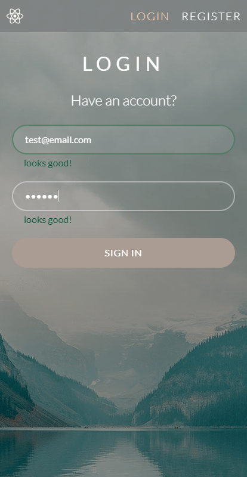
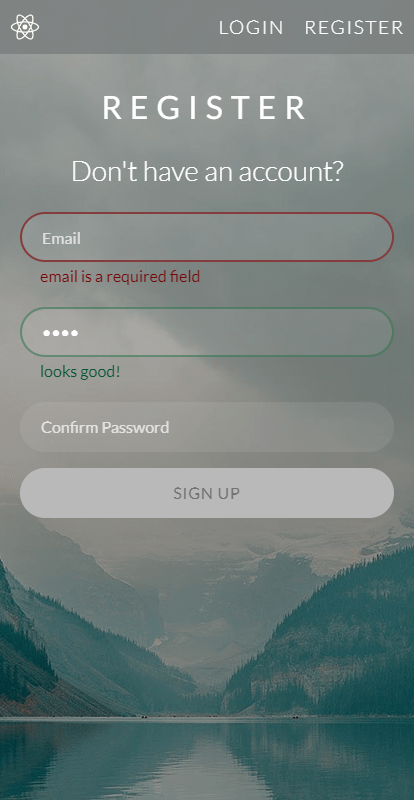
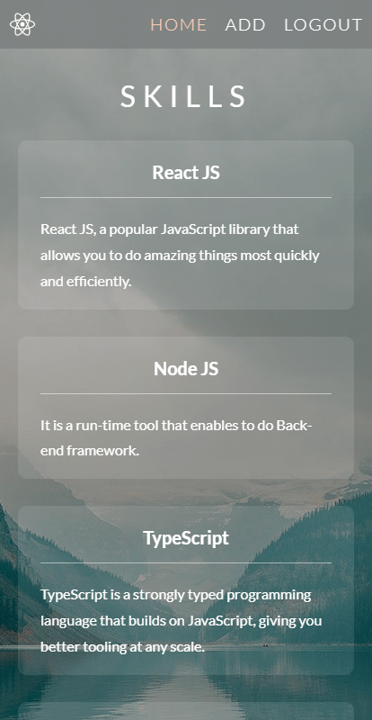
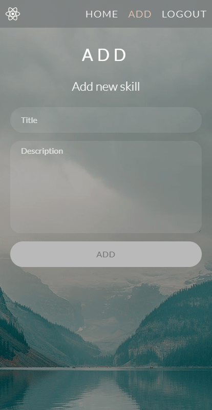

# CA React - Skills page with authentication

With this app you can register new user, login and logout, create new skill and see all of your skills.
<br /><br />

# 🎨 Main features

- Login, Register pages - authentication
- Home page - show's logged in user's skills
- Add page - user can add new skill
- Routes are protected from unauthenticated users
- All forms has validation
<br />

# 🚀 Getting started

### 🔨 Configure files

Rename `.env.example` to `.env` and put your credentials in it. For this project I was using [this](https://autumn-delicate-wilderness.glitch.me) back-end server.
<br />

### 🎈 Start the project

```
npm install
npm start
```

- The app runs in the development mode.
- Open [http://localhost:3000](http://localhost:3000) to view it in your browser.
- The page will reload when you make changes.
- You may also see any lint errors in the console.

<p align="right">(<a href="#top">back to top</a>)</p>

# 🔧 Technologies Used

- React
- CSS Modules

### 📜 Sources

This project was bootstrapped with [Create React App](https://github.com/facebook/create-react-app)

### 📦 Additionally installed packages

- react-router-dom 5.3.3
- formik 2.2.9
- yup 0.32.11
- prop-types 15.8.1

<p align="right">(<a href="#top">back to top</a>)</p>

# 💻 Demo
<br/>

<table>
  <tr>
    <td>Login page</td>
    <td>Register page</td>
    <td>Home (skills) page</td>
    <td>Add (skill) page</td>
  </tr>
  <tr>
    <td></td>
    <td></td>
    <td></td>
    <td></td>
  </tr>
</table>

[🔼 Back To Top](#top)
